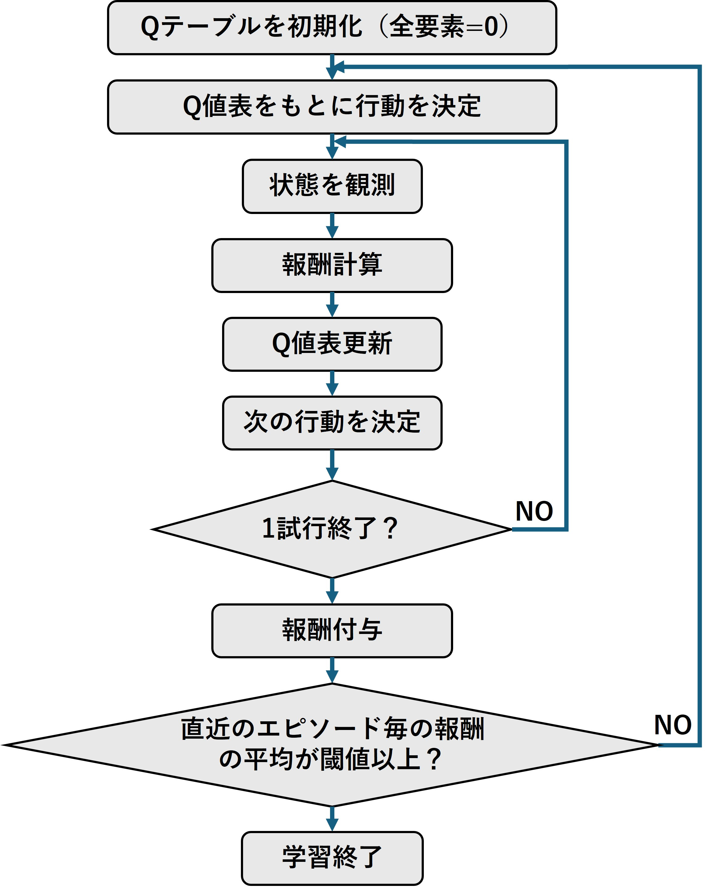
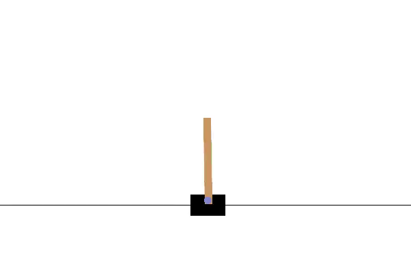
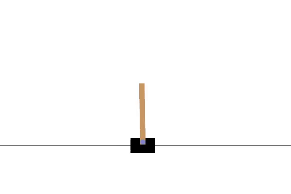
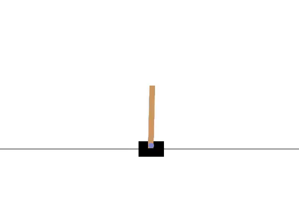
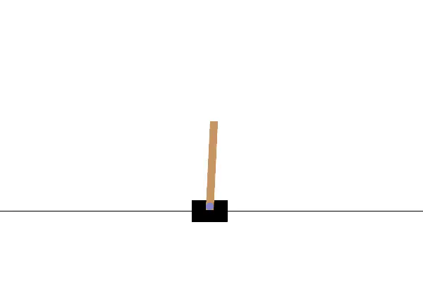
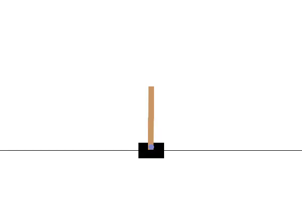
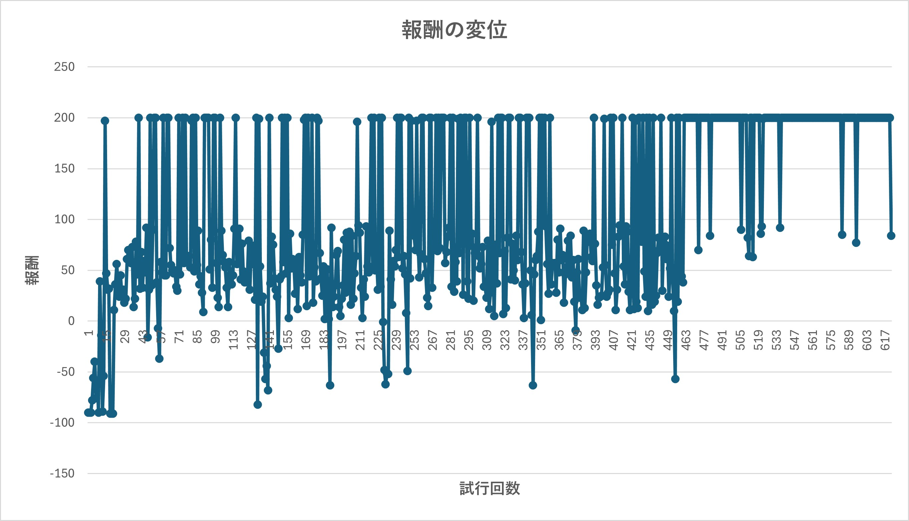

# Q学習を利用した1次元倒立振子
１自由度倒立振子を数直線上に配置し，倒れないように移動させるようなモデルをQ学習を用いて実装


# 環境
- 環境：Ubuntu 24.04.1 LTS (WSL2)
- 言語：Python 3.12.3 (venv)
- シミュレータ：gymnasium (旧 OpenAI gym)  

# 理論復習
## 強化学習の重要要素
- 状態
- 行動
- 状態価値関数
- 行動価値関数
- 戦略
- 遷移関数
- 報酬

## 価値関数
- 価値関数=期待値
### 状態価値関数
- $V^\pi(s)$ で表現される
- 状態 $s$ にあることの価値
- 系の状態（振り子の位置・角度・速度・角速度）の価値
- 状態価値関数は方策によって変動

### 行動価値関数
- $Q^\pi(s, a)$ で表現される
- 状態 $s$ で行動 $a$ をとる価値

## 戦略
- $\pi$で表現される
- とある状態でとある行動をとる確率
  - 振り子が右に傾いた状態で台車を右に移動させる確率など
- ある状態 $s$ から行動 $a$ をとる確率は $\pi(a|s)$ となる（行動確率とも）

## 遷移関数
- ある状態と行動からまたある状態に遷移する確率
- 必ずしも決められた状態に遷移するわけではない
  - 例：右レーンへ車線変更を試みたが後方から車が来て車線変更できなかった
- $T(s'|s,a)$：ある状態 $s$ から行動 $a$ をとって状態 $s'$ に遷移する確率

## ベルマン方程式の利用
- 価値関数（状態価値関数 $V^\pi(s)$，行動価値関数 $Q^\pi(s, a)$）を漸化式で表現するために用いる
- 状態価値関数 $V^\pi(s)$を使った価値の期待値は
```math
\begin{equation}
V^\pi(s) = \Sigma_a \pi(a|s) \Sigma_{s'} T(s'|s, a)(R(s, s') + \gamma V^\pi(s'))
\end{equation}
```
  で表現できる
- ある状態 $s$ の時の最適な行動 $s$ を知りたい
- 最適行動を得るには  
  1. 時刻 $t$ である行動 $a^1_t$ をとった後の状態価値関数 $V^\pi(s_{t+1})$ を求める
  2. 時刻 $t$ で1.とは別の行動 $a^2_t$ をとった後の状態価値関数 $V^\pi(s_{t+1})$ を求める
  3. 残りのとりうる行動全てにおいて同様の操作をする
  4. 最大の状態価値関数 $V^\pi(s_{t+1})$ になる行動を採用する
   
- 行動価値関数 $Q^\pi(s, a)$ は必ずしも戦略 $\pi$ に従うわけではない
- ある行動 $a$ をとり遷移確率 $P^a_{ss'}$ で状態 $s'$ に遷移するとき，行動価値関数は
```math
\begin{equation}
Q^\pi(s,a) = \Sigma_{s'} P^a_{ss'}\left[R^a_{ss'}+\gamma V^\pi(s')\right]
\end{equation}
```
  で表現できる  
  $R^a_{ss'}$ は状態 $s$ から行動 $a$ をとり，状態 $s'$ に遷移した時の報酬
- $V^\pi(s)$ から方策 $\pi(s,a)$ に従い，行動するが**結果的にある行動 $a$ をとった後の価値は $Q^\pi(s,a)$ **となる
- なので，
```math
\begin{equation}
V^\pi(s) = \Sigma_a \pi(a|s) Q^\pi(s,a)
\end{equation}
```  
  と表現できる．行動確率と行動価値関数の期待値で表現している．
- 上式を $Q^\pi(s,a)$ に代入すると
```math
\begin{equation}
Q^\pi(s,a) = \Sigma_{s'} P^a_{ss'} \left[ R^a_{ss'} + \gamma \Sigma_{a'} \pi(a'|s') Q^\pi(s',a') \right]
\end{equation}
```  
  となる

## Q学習とは
- 最適な行動価値関数 $Q^\pi(s,a)$ を求めること
- 状態遷移毎に得られる報酬から， $Q^\pi(s,a)$ を更新するアルゴリズム
- Q学習の更新方法
  - $Q^\pi(s,a) \gets r + max_{a'} Q(s',a')$だけでは学習できない
    - 行動$a$ がランダムの場合は値が安定しない
    - 本来は統計をとる必要あり
  - 更新前の値も含めることで過去の行動価値関数の実績を考慮
```math
\begin{equation}
Q(s,a) = (1-\alpha) Q(s,a) + \alpha \left[r + max_{a'} Q(s',a')\right]
\end{equation}
```
  - $\alpha$ を小さくする←過去の行動価値関数が支配的になる

# 倒立振子をQ学習で制御（実装内容）
## 処理の流れ
- Q値は全要素を0で初期化
- $\epsilon$ -greedy法で学習初期の行動を高確率でランダム選択
- 学習を進めるにつれて確率 $\epsilon$ の値を減衰
- 初期値 $\epsilon=0.5$ とした
- 行動価値関数 $Q(s,a)$ は上述した式を利用
  
-   

## 状態  
- 振り子の状態は $s = [x, \theta, v, \omega]$ の4次元で表現
    1. $x$：振り子位置（-2.4 ≦ $x$ ≦ 2.4）
    2. $v$：振り子速度（- $\infty$ ≦ $v$ ≦ $\infty$）
    3. $\theta$：振り子角度（-24 ≦ $\theta$ ≦ 24）
    4. $\omega$：振り子角速度（- $\infty$ ≦ $\omega$ ≦ $\infty$）

- 状態の離散化  
  - 計算量の都合から位置や速度などを適度に分割し離散化
  - 今回は各パラメータを3分割
  - $状態数=3^4=81通り$

## 行動
- 振り子に対する操作＝行動は $a = [0, 1]$（左，右）で表現
- 行動数 = 2

## 報酬
- 直立していたら加点：+1
- 振り子が倒れたら減点（地面と振り子のなす角が閾値以下）：-100

## 評価方法
- 報酬値が高いほどよい行動
- 学習結果のレンダリング動画を見て制御できているか官能評価

## 学習の終了判定
- 終了判定：直近100試行の報酬の平均値が閾値以上
- 今回は閾値を195(報酬の最大値は200)とした

# 結果
## 学習前
- ランダムに台車が移動
- 振り子の制御ができていない  
  

## 学習後
- 0試行目の様子  
  - 全然倒立できていない  

  -   

- 10試行目の様子  
  - 倒立し始めるが，横移動しながらフェードアウトしてしまう
  -   

- 100試行目の様子  
  - 同様に倒立するが，フェードアウト
  -   

- 200試行目の様子  
  - 同様に倒立するが，フェードアウト
  -   

- 500試行目の様子  
  - 横揺れすることで倒立と位置の保持をし続けるようになる
  -   

- 学習後の様子  
  - まだ，改善の余地があるがおおむね倒立することができている 
  -   

## 獲得報酬の変位
- 学習開始から終了までの報酬の増減をグラフで表示
- 全体的に報酬の増減が激しいが増加傾向となっている
- 450回目の試行付近で報酬が高くなっている
- 特に，学習終了間際では連続して報酬の最大値をとっている

-   

# まとめ
- 倒立振子を題材にしたQ学習のモデル化・実装を行った
- 学習により倒立振子を比較的長時間立たせることができた
- 学習後も振り子の若干の横揺れが見られるので位置や角度に対する加減点など，報酬の見直しで改善できるのではないかと考える
- さらに学習を進めることで改善される考える


# 参考文献
## 強化学習の理論について
1. [確率ロボティクス第12回講義資料](https://ryuichiueda.github.io/slides_marp/prob_robotics_2024/lesson12)
2. [今さら聞けない強化学習（1）：状態価値関数とBellman方程式](https://qiita.com/triwave33/items/5e13e03d4d76b71bc802)
3. [今さら聞けない強化学習（3）：行動価値関数とBellman方程式](https://qiita.com/triwave33/items/8966890701169f8cad47)
4. [（私のような）猿でもわかる強化学習（Q学習）](https://qiita.com/mine820/items/e51c91660cef00a50006)
5. [【強化学習初心者向け】シンプルな実装例で学ぶQ学習、DQN、DDQN【CartPoleで棒立て：1ファイルで完結、Kearas使用】](https://qiita.com/sugulu_Ogawa_ISID/items/bc7c70e6658f204f85f9)
6. [強化学習のQ関数について調べてみた](https://zenn.dev/channnnsm/articles/ce5c4a69a8de40)
## 強化学習の実装方法について
8. [Open AI GymのCartPoleコードをいじりながら仕組みを学ぶ（１）](https://qiita.com/masataka46/items/cc37d36137a4a162c04a)
9. [OpenAI Gym 入門](https://qiita.com/ishizakiiii/items/75bc2176a1e0b65bdd16)