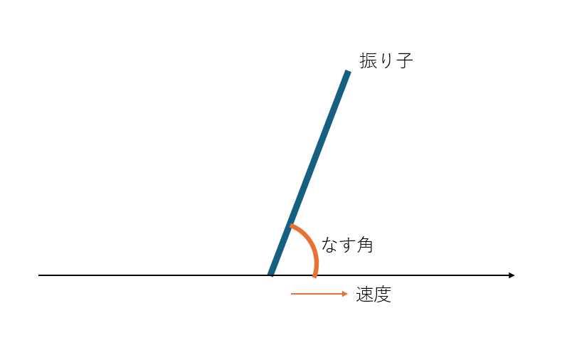

# Q学習を利用した1次元倒立振子
# 実装内容
１自由度倒立振子を数直線上に配置し，倒れないように移動させるようなモデルをQ学習を用いて実装


# 理論復習
## 強化学習の重要要素
- 状態
- 行動
- 状態価値関数
- 行動価値関数
- 戦略
- 遷移関数
- 報酬

## 状態価値関数
- $V^\pi(s)$ で表現される
- 状態 $s$ にあることの価値
- 系の状態（振り子の位置・角度・速度・角速度）の価値
- 状態価値関数は方策によって変動

## 行動価値関数
- $Q^\pi(s, a)$で表現される
- 状態$s$で行動$a$をとる価値

## 戦略
- $\pi$で表現される
- とある状態でとある行動をとる確率
  - 振り子が右に傾いた状態で台車を右に移動させる確率など
- ある状態 $s$ から行動 $a$ をとる確率は $\pi(a|s)$ となる（行動確率とも）

## 遷移関数
- ある状態と行動からまたある状態に遷移する確率
- 必ずしも決められた状態に遷移するわけではない
  - 例：右レーンへ車線変更を試みたが後方から車が来て車線変更できなかった
- $T(s'|s,a)$：ある状態 $s$ から行動 $a$ をとって状態 $s'$ に遷移する確率

## ベルマン方程式の利用
- 価値関数（状態価値関数 $V^\pi(s)$，行動価値関数 $Q^\pi(s, a)$）を漸化式で表現するために用いる
- 状態価値関数 $V^\pi(s)$を使った価値の期待値は
  $$V^\pi(s) = \Sigma_a \pi(a|s) \Sigma_{s'} T(s'|s, a)(R(s, s') + \gamma V^\pi(s'))$$  
  で表現できる
- ある状態 $s$ の時の最適な行動 $s$ を知りたい
- 最適行動を得るには  
  1. 時刻 $t$ である行動 $a^1_t$ をとった後の状態価値関数 $V^\pi(s_{t+1})$ を求める
  2. 時刻 $t$ で1.とは別の行動 $a^2_t$ をとった後の状態価値関数 $V^\pi(s_{t+1})$ を求める
  3. 残りのとりうる行動全てにおいて同様の操作をする
  4. 最大の状態価値関数 $V^\pi(s_{t+1})$ になる行動を採用する
- 行動価値関数 $Q^\pi(s, a)$ は必ずしも戦略 $\pi$ に従うわけではない
- ある行動 $a$ をとり遷移確率 $P^a_{ss'}$ で状態 $s'$ に遷移するとき，行動価値関数は
  $$Q^\pi(s,a) = \Sigma_{s'} P^a_{ss'}\left[R^a_{ss'}+\gamma V^\pi(s')\right]$$  
  で表現できる  
  $R^a_{ss'}$ は状態 $s$ から行動 $a$ をとり，状態 $s'$ に遷移した時の報酬
- $V^\pi(s)$ から方策 $\pi(s,a)$ に従い，行動するが**結果的にある行動 $a$ をとった後の価値は $Q^\pi(s,a)$ **となる
- なので，
  $$V^\pi(s) = \Sigma_a \pi(a|s) Q^\pi(s,a)$$  
  と表現できる．行動確率と行動価値関数の期待値で表現している．
- 上式を $Q^\pi(s,a)$ に代入すると  
  $$Q^\pi(s,a) = \Sigma_{s'} P^a_{ss'} \left[ R^a_{ss'} + \gamma \Sigma_{a'} \pi(a'|s') Q^\pi(s',a') \right]$$  
  となる

## Q学習とは
- 最適な行動価値関数 $Q^\pi(s,a)$ を求めること
- 状態遷移毎に得られる報酬から，$Q^\pi(s,a)$ を更新するアルゴリズム
- Q学習の更新方法
  - $Q^\pi(s,a) \gets r + max_{a'} Q(s',a')$だけでは学習できない
    - 行動$a$ がランダムの場合は値が安定しない
    - 本来：統計をとる必要あり
  - 更新前の値も含めることで過去の行動価値関数の実績を考慮
    - $Q(s,a) = (1-\alpha) Q(s,a) + \alpha \left[r + max_{a'} Q(s',a')\right]$  
    - $\alpha$ を小さくする←過去の行動価値関数が支配的になる

# 倒立振子をQ学習で制御
## 状態  
- 振り子の状態は$s = [x, \theta, v, \omega]$の4次元で表現
    1. $x$：振り子位置（-2.4 ≦ $x$ ≦ 2.4）
    2. $\theta$：振り子角度（-41.8 ≦ $\theta$ ≦ 41.8）
    3. $v$：振り子速度（- $\infty$ ≦ $v$ ≦ $\infty$）
    4. $\omega$：振り子角速度（- $\infty$ ≦ $\omega$ ≦ $\infty$）

- 状態の離散化  
  - 計算量の都合から位置や速度などを適度に分割し離散化
    - 位置・角度については5分割
    - 速度・角速度については2分割  

```math
\begin{equation}
x=\left[\begin{matrix}-\infty \leqq x \lt -1.44  \\
-1.44 \leqq x \lt -0.48  \\
-0.48 \leqq x \lt 0.48  \\
0.48 \leqq x \lt 1.44  \\
1.44 \leqq x \lt \infty \end{matrix} \right]
\end{equation}
``` 

```math
\begin{equation}
\theta=\left[\begin{matrix}-\infty \leqq \theta \lt -1.44 \\ -1.44 \leqq \theta \lt -0.48 \\ -0.48 \leqq \theta \lt 0.48 \\ 0.48 \leqq \theta \lt 1.44 \\ 1.44 \leqq \theta \lt \infty \end{matrix} \right]
\end{equation}
``` 

```math
\begin{equation}
v = \left[ \begin{matrix} -\infty \lt 0 \\ 0 \leqq \infty \end{matrix}\right]
\end{equation}
``` 

```math
\begin{equation}
\omega = \left[ \begin{matrix} -\infty \lt 0 \\ 0 \leqq \infty \end{matrix}\right]
\end{equation}
``` 

  - 状態数 = 5x5x2x2 = 100

## 行動
- 振り子に対する操作＝行動は$a = [0, 1]$（左，右）で表現
- 行動数 = 2

## 報酬
- なるべく直立で長く倒立している状態を高く評価
- 振り子が倒れたら減点（地面と振り子のなす角が閾値以下）

## 方策

## 評価

## 学習の終了判定
- 変化量の最大値が閾値以下

# 結果
## 学習前
- ランダムに台車が移動
- 振り子の制御ができていない  
  

## 学習後
## Q値の変化
- 学習回数別のQ値変化
# まとめ
- 倒立振子を題材にしたQ学習のモデル化・実装を行った
- 学習により倒立振子を長時間立たせることができた
## 参考文献
1. [確率ロボティクス第12回講義資料](https://ryuichiueda.github.io/slides_marp/prob_robotics_2024/lesson12)
2. [今さら聞けない強化学習（1）：状態価値関数とBellman方程式](https://qiita.com/triwave33/items/5e13e03d4d76b71bc802)
3. [今さら聞けない強化学習（3）：行動価値関数とBellman方程式](https://qiita.com/triwave33/items/8966890701169f8cad47)